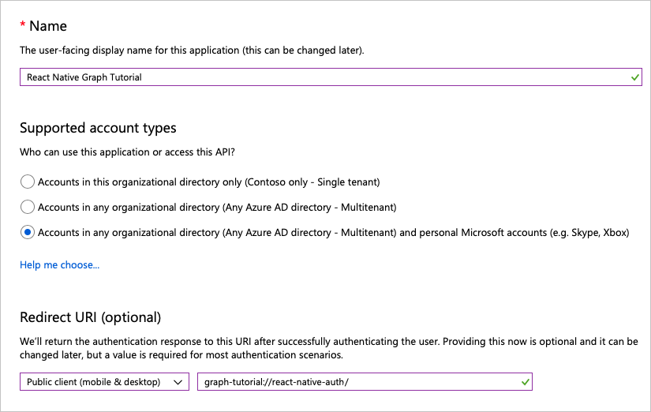

<!-- markdownlint-disable MD002 MD041 -->

在本练习中，你将使用 Azure Active Directory 管理中心创建新的 Azure AD native 应用程序。In this exercise you will create a new Azure AD native application using the Azure Active Directory admin center.

1. 打开浏览器，并转到 [Azure Active Directory 管理中心](https://aad.portal.azure.com)。然后，使用**个人帐户**（亦称为“Microsoft 帐户”）或**工作或学校帐户**登录。Open a browser and navigate to the [Azure Active Directory admin center](https://aad.portal.azure.com) and login using a **personal account** (aka: Microsoft Account) or **Work or School Account**.

1. 在左侧导航栏中选择 " **Azure Active Directory** "，然后选择 "**管理**" 下的 "**应用程序注册**"。Select **Azure Active Directory** in the left-hand navigation, then select **App registrations** under **Manage**.

    

1. 选择“新注册”\*\*\*\*。Select **New registration**. 在“注册应用”\*\*\*\* 页上，按如下方式设置值。On the **Register an application** page, set the values as follows.

    - 将“名称”\*\*\*\* 设置为“`React Native Graph Tutorial`”。Set **Name** to `React Native Graph Tutorial`.
    - 将“受支持的帐户类型”\*\*\*\* 设置为“任何组织目录中的帐户和个人 Microsoft 帐户”\*\*\*\*。Set **Supported account types** to **Accounts in any organizational directory and personal Microsoft accounts**.
    - 在 "**重定向 URI**" 下，将下拉列表更改为 "**公用客户端（移动 & 桌面）**"，并将值设置为`graph-tutorial://react-native-auth`。Under **Redirect URI**, change the dropdown to **Public client (mobile & desktop)**, and set the value to `graph-tutorial://react-native-auth`.

    

1. 选择 "**注册**"。Select **Register**. 在 "**响应本机图形教程**" 页上，复制**应用程序（客户端） ID**的值并保存它，下一步将需要它。On the **React Native Graph Tutorial** page, copy the value of the **Application (client) ID** and save it, you will need it in the next step.

    

1. 在 "**管理**" 下，选择 "**身份验证**"。Under **Manage**, select **Authentication**. 在 "**重定向 uri** " 页上，使用 URI `urn:ietf:wg:oauth:2.0:oob`添加另一个类型为 "**公用客户端（移动 & 桌面）**" 的重定向 uri。On the **Redirect URIs** page, add another redirect URI of type **Public client (mobile & desktop)**, with the URI `urn:ietf:wg:oauth:2.0:oob`. 选择“**保存**”。Select **Save**.

    
